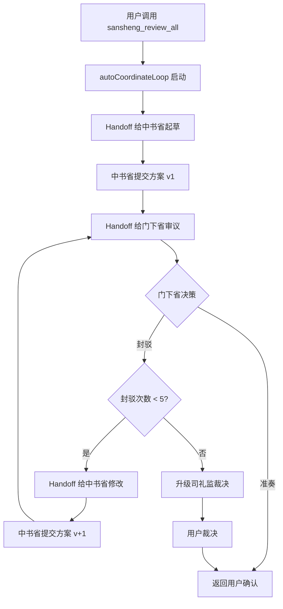

# 三省审议流水线技术架构

**版本**: v1.0
**日期**: 2026-03-11
**编撰**: 礼部
**状态**: 正式版

---

## 一、架构概览

### 1.1 核心设计

三省审议流水线采用**点对点 Agent 协作**模式，而非传统的"中心调度 + Worker 执行"模式。

**关键特性**：
- ✅ 去中心化：中书省 ↔ 门下省直接 handoff，无需中间转发
- ✅ 自动循环：封驳-修改-审议自动迭代，无需人工干预
- ✅ 状态持久化：所有任务状态存储在 JSON 文件，支持崩溃恢复
- ✅ 完整审计：所有 handoff 事件记录到 JSONL，可追溯

### 1.2 架构层次

```
┌─────────────────────────────────────────────────┐
│          用户 (Claude Code Session)             │
└─────────────────┬───────────────────────────────┘
                  │ 调用 sansheng_review_all
                  ↓
┌─────────────────────────────────────────────────┐
│         MCP Server (TypeScript)                 │
│  • sansheng.ts: 自动循环协调                    │
│  • handoff.ts: Agent handoff 机制               │
│  • utils.ts: Python 调用桥接（Base64）          │
└─────────────────┬───────────────────────────────┘
                  │ handoffWithRetry()
                  ↓
┌─────────────────────────────────────────────────┐
│       Agent 调用层 (Python)                     │
│  • call_mcp_agent.py: Agent 调用桥接            │
│  • agent_internal_tools.py: Agent 内部工具      │
└─────────────────┬───────────────────────────────┘
                  │ invoke_zhongshu_agent()
                  │ invoke_menxia_agent()
                  ↓
┌─────────────────────────────────────────────────┐
│       数据持久化层 (Python)                     │
│  • task_state.py: 任务状态管理                  │
│  • audit_log.py: 审计日志记录                   │
│  • handoff_validator.py: 消息验证               │
└─────────────────┬───────────────────────────────┘
                  │ 读写
                  ↓
┌─────────────────────────────────────────────────┐
│          数据存储 (JSON/JSONL)                  │
│  • data/tasks.json: 任务状态                    │
│  • data/audit/audit-YYYYMMDD.jsonl: 审计日志   │
└─────────────────────────────────────────────────┘
```

---

## 二、自动循环协调机制

### 2.1 核心函数：autoCoordinateLoop()

**位置**：`mcp-server/src/sansheng.ts:165`

**职责**：
- 启动中书省起草
- 循环调用门下省审议
- 处理封驳和准奏
- 升级裁决

**伪代码**：
```typescript
async function autoCoordinateLoop(taskId: string) {
  const MAX_REJECTIONS = 5;
  let rejectionCount = 0;
  let version = 0;

  // 步骤 1: 中书省起草
  const draftResult = await handoffWithRetry('zhongshu', {
    task_id: taskId,
    action: 'draft',
    content: { instruction: '请起草执行方案' }
  });
  version = draftResult.version;

  // 步骤 2: 循环审议
  while (rejectionCount < MAX_REJECTIONS) {
    // 2.1 门下省审议
    const reviewResult = await handoffWithRetry('menxia', {
      task_id: taskId,
      action: 'review',
      content: { version: version }
    });

    // 2.2 准奏 → 返回结果
    if (reviewResult.decision === 'approved') {
      return {
        status: 'approved',
        final_plan: reviewResult.plan,
        meta: { versions: version, rejections: rejectionCount }
      };
    }

    // 2.3 封驳 → 中书省修改
    if (reviewResult.decision === 'rejected') {
      rejectionCount++;

      // 2.3.1 封驳 5 次 → 升级裁决
      if (rejectionCount >= MAX_REJECTIONS) {
        return {
          status: 'escalated',
          rejection_count: rejectionCount,
          summary: `方案 v${version} 已被封驳 5 次，需要圣上裁决`
        };
      }

      // 2.3.2 中书省修改
      const reviseResult = await handoffWithRetry('zhongshu', {
        task_id: taskId,
        action: 'revise',
        content: {
          rejection_reason: reviewResult.reason,
          rejection_count: rejectionCount
        }
      });
      version = reviseResult.version;
    }
  }
}
```

### 2.2 流程图



---

## 三、Handoff 机制

### 3.1 Handoff 消息格式

**JSON Schema**：
```json
{
  "task_id": "TASK-YYYYMMDD-NNN",
  "from_agent": "zhongshu | menxia | shangshu | ...",
  "to_agent": "zhongshu | menxia | shangshu | ...",
  "action": "draft | review | approve | reject | revise | escalate | execute | report",
  "content": { /* 根据 action 不同而不同 */ },
  "timestamp": "2026-03-11T10:30:45.123Z"
}
```

**合法 action 清单**（`lib/handoff_validator.py:9`）：
- `draft`：起草新方案（司礼监 → 中书省）
- `revise`：修改方案（门下省 → 中书省）
- `review`：审议方案（中书省 → 门下省）
- `approve`：批准方案（门下省 → 司礼监）
- `reject`：封驳方案（门下省 → 中书省）
- `escalate`：升级裁决（门下省 → 司礼监）
- `execute`：执行任务（尚书省 → 六部）
- `report`：汇报结果（六部 → 尚书省）

### 3.2 Handoff 调用流程

**TypeScript 层**（`mcp-server/src/handoff.ts:47`）：
```typescript
export async function handoffWithRetry(
  toAgent: string,
  message: any,
  maxRetries: number = 3,
  baseInterval: number = 1000
): Promise<HandoffResult> {
  for (let attempt = 1; attempt <= maxRetries; attempt++) {
    try {
      // 1. 验证消息格式
      const validationResult = await callPythonFunction(
        'lib/handoff_validator.py',
        'validate_handoff_message',
        { message: message }
      );

      if (!validationResult.is_valid) {
        throw new Error(`消息格式错误: ${validationResult.errors.join(', ')}`);
      }

      // 2. 调用 Python 层 Agent
      const agentResult = await callPythonFunction(
        'lib/call_mcp_agent.py',
        'invoke_agent',
        { agent_name: toAgent, message: message }
      );

      // 3. 记录成功日志
      await callPythonFunction(
        'lib/audit_log.py',
        'log_event',
        {
          actor_id: 'sansheng_coordinator',
          action_type: 'handoff_completed',
          target_id: toAgent,
          result: 'success',
          details: { task_id: message.task_id, action: message.action }
        }
      );

      return { success: true, result: agentResult };

    } catch (error) {
      // 4. 重试逻辑
      if (attempt < maxRetries) {
        const delay = baseInterval * Math.pow(2, attempt - 1);
        await sleep(delay);
        continue;
      }

      // 5. 失败后记录日志
      await callPythonFunction(
        'lib/audit_log.py',
        'log_event',
        {
          actor_id: 'sansheng_coordinator',
          action_type: 'handoff_failed',
          target_id: toAgent,
          result: 'failure',
          details: { error: error.message, attempts: maxRetries }
        }
      );

      return { success: false, error: error.message };
    }
  }
}
```

**Python 层**（`lib/call_mcp_agent.py:112`）：
```python
def invoke_agent(agent_name: str, message: Dict[str, Any]) -> Dict[str, Any]:
    """
    调用 Agent（中书省或门下省）

    Args:
        agent_name: 'zhongshu' | 'menxia'
        message: Handoff 消息（已通过 TypeScript 层验证）

    Returns:
        Agent 执行结果
    """
    task_id = message['task_id']
    action = message['action']
    content = message['content']

    # 记录 handoff 开始
    log_event(
        actor_id='sansheng_coordinator',
        action_type='handoff_initiated',
        target_id=agent_name,
        result='started',
        details={'task_id': task_id, 'action': action}
    )

    # 路由到具体 Agent
    if agent_name == 'zhongshu':
        return invoke_zhongshu_agent(task_id, action, content)
    elif agent_name == 'menxia':
        return invoke_menxia_agent(task_id, action, content)
    else:
        raise ValueError(f"Unknown agent: {agent_name}")
```

### 3.3 重试策略

**指数退避**：
- 第 1 次重试：延迟 1s（baseInterval * 2^0）
- 第 2 次重试：延迟 2s（baseInterval * 2^1）
- 第 3 次重试：延迟 4s（baseInterval * 2^2）
- 失败后：记录日志，返回错误

**总延迟**：最大 7s（1s + 2s + 4s）

---

## 四、Agent 实现

### 4.1 中书省 Agent

**核心函数**：`invoke_zhongshu_agent()` (`lib/call_mcp_agent.py:132`)

**支持的 action**：
- `draft`：起草新方案
- `revise`：修改方案（响应封驳）

**工作流程**：
```python
def invoke_zhongshu_agent(task_id, action, content):
    # 1. 获取任务信息
    task_info = zhongshu_internal(task_id, action, content)

    # 2. 生成方案
    if action == 'draft':
        plan = _generate_initial_plan(task_info)
    elif action == 'revise':
        plan = _generate_revised_plan(task_info)

    # 3. 提交方案
    result = zhongshu_submit_plan(task_id, plan)

    return {
        'agent': 'zhongshu',
        'action': action,
        'version': result['version'],
        'plan': plan,
        'status': 'submitted'
    }
```

**方案生成策略**：

**初始方案**（`_generate_initial_plan`）：
- 根据 context 长度生成不同质量的方案
- context >= 50 字：生成完整方案（包含风险评估和验收标准）
- context < 50 字：生成简化方案（会被封驳）

**修订方案**（`_generate_revised_plan`）：
- 根据 rejection_count 渐进式补充内容
- rejection_count >= 1：补充风险评估
- rejection_count >= 2：补充验收标准
- rejection_count >= 3：补充技术细节
- rejection_count >= 4：补充性能指标
- rejection_count >= 5：补充安全审计

### 4.2 门下省 Agent

**核心函数**：`invoke_menxia_agent()` (`lib/call_mcp_agent.py:305`)

**支持的 action**：
- `review`：审议方案

**工作流程**：
```python
def invoke_menxia_agent(task_id, action, content):
    # 1. 获取待审议方案
    version = content.get('version', 1)
    plan_info = menxia_internal(task_id, version)

    # 2. 审议方案
    plan = plan_info['plan']
    rejection_count = plan_info['rejection_count']

    # 执行质量检查（渐进式）
    check_result = _check_plan_quality(plan, rejection_count)

    if check_result['passed']:
        # 准奏
        menxia_submit_decision(task_id, 'approved')
        return {
            'agent': 'menxia',
            'decision': 'approved',
            'version': version,
            'plan': plan
        }
    else:
        # 封驳
        reason = _format_rejection_reason(check_result['issues'])
        menxia_submit_decision(task_id, 'rejected', reason)
        return {
            'agent': 'menxia',
            'decision': 'rejected',
            'version': version,
            'reason': reason,
            'rejection_count': rejection_count + 1
        }
```

**质量检查策略**（`_check_plan_quality`）：

**基础检查**（每次必查）：
1. 长度检查：>= 100 字
2. 结构检查：包含"步骤"或"方案"
3. 目标检查：包含"目标"或"背景"
4. 可执行性：有效内容行 >= 5
5. 完整性：章节数量足够

**渐进式内容检查**：
```python
if rejection_count == 0:
    # 第 0 次审议：只检查风险评估
    if '风险' not in plan and '应对' not in plan:
        issues.append("方案缺少风险评估章节")

elif rejection_count == 1:
    # 第 1 次审议：只检查验收标准
    if '验收' not in plan and '标准' not in plan:
        issues.append("方案缺少验收标准章节")

elif rejection_count == 2:
    # 第 2 次审议：只检查技术细节
    if '技术细节' not in plan or '待补充' in plan:
        issues.append("方案缺少技术细节说明")

elif rejection_count == 3:
    # 第 3 次审议：只检查性能指标
    if '性能' not in plan and 'QPS' not in plan:
        issues.append("方案缺少性能指标章节")

elif rejection_count == 4:
    # 第 4 次审议：只检查安全审计
    if '安全' not in plan and '权限' not in plan:
        issues.append("方案缺少安全审计章节")
```

---

## 五、数据持久化

### 5.1 任务状态管理

**存储文件**：`~/.claude/plugins/sansheng-pipeline/data/tasks.json`

**数据结构**：
```json
[
  {
    "id": "TASK-20260311-001",
    "title": "实现用户注册系统",
    "context": "需要支持手机号+验证码登录...",
    "state": "reviewing",
    "created_at": "2026-03-11T10:00:00Z",
    "updated_at": "2026-03-11T10:15:00Z",
    "versions": [
      {
        "version": 1,
        "plan": "## 执行方案\n...",
        "author": "zhongshu",
        "created_at": "2026-03-11T10:05:00Z"
      },
      {
        "version": 2,
        "plan": "## 执行方案（修订版 v2）\n...",
        "author": "zhongshu",
        "created_at": "2026-03-11T10:12:00Z"
      }
    ],
    "rejections": [
      {
        "count": 1,
        "reason": "方案缺少风险评估章节",
        "timestamp": "2026-03-11T10:08:00Z"
      }
    ]
  }
]
```

**核心 API**（`lib/task_state.py`）：
```python
# 创建任务
task_id = create_task(title, context)

# 添加方案版本
add_plan_version(task_id, plan, author='zhongshu')

# 记录封驳
add_rejection(task_id, reason)

# 查询封驳次数
count = get_rejection_count(task_id)

# 更新状态
update_state(task_id, 'approved', '门下省准奏')
```

### 5.2 审计日志

**存储文件**：`~/.claude/plugins/sansheng-pipeline/data/audit/audit-YYYYMMDD.jsonl`

**日志格式**：
```json
{
  "event_id": "EVT-20260311-12345678",
  "timestamp": "2026-03-11T10:30:45.123Z",
  "actor": {
    "type": "agent",
    "id": "zhongshu"
  },
  "action": {
    "type": "plan_submitted",
    "verb": "CREATE",
    "resource": "plan",
    "resource_id": "TASK-20260311-001-v1"
  },
  "target": {
    "type": "task",
    "id": "TASK-20260311-001"
  },
  "result": "success",
  "details": {
    "version": 1,
    "plan_length": 1234,
    "elapsed_time_ms": 156
  }
}
```

**关键事件类型**：
- `handoff_initiated`：发起 handoff
- `handoff_completed`：handoff 成功
- `handoff_failed`：handoff 失败
- `plan_submitted`：中书省提交方案
- `plan_approved`：门下省准奏
- `plan_rejected`：门下省封驳
- `task_escalated`：升级裁决

**查询示例**：
```bash
# 查看今日所有 handoff 事件
grep 'handoff' ~/.claude/plugins/sansheng-pipeline/data/audit/audit-$(date +%Y%m%d).jsonl

# 统计封驳次数
grep 'plan_rejected' ~/.claude/plugins/sansheng-pipeline/data/audit/audit-$(date +%Y%m%d).jsonl | wc -l

# 查看某个任务的所有事件
grep 'TASK-20260311-001' ~/.claude/plugins/sansheng-pipeline/data/audit/audit-20260311.jsonl
```

---

## 六、跨语言调用

### 6.1 TypeScript 调用 Python

**问题**：TypeScript 需要调用 Python 函数，但参数包含复杂 JSON 结构，shell 转义容易出错。

**解决方案**：Base64 编码（`mcp-server/src/utils.ts:25`）

**实现**：
```typescript
export async function execPython(
  scriptPath: string,
  functionName: string,
  args: any
): Promise<PythonResult> {
  // 1. JSON 序列化
  const argsJson = JSON.stringify(args);

  // 2. Base64 编码（避免 shell 转义）
  const argsBase64 = Buffer.from(argsJson).toString('base64');

  // 3. Python 代码模板
  const pythonCode = `
import sys
import json
import base64
sys.path.insert(0, '.')
from ${scriptPath.replace('.py', '').replace(/\//g, '.')} import ${functionName}

# 解码参数
args_json = base64.b64decode('${argsBase64}').decode('utf-8')
args = json.loads(args_json)

# 调用函数
result = ${functionName}(**args)

# 返回结果
print(json.dumps(result, ensure_ascii=False))
  `;

  // 4. 执行 Python
  const result = execSync(`python3 -c "${pythonCode}"`, {
    encoding: 'utf-8',
    maxBuffer: 10 * 1024 * 1024,  // 10MB
    timeout: 30000  // 30 秒
  });

  // 5. 解析结果
  return { success: true, data: JSON.parse(result) };
}
```

**调用示例**：
```typescript
// TypeScript 调用 Python
const result = await callPythonFunction(
  'lib/call_mcp_agent.py',
  'invoke_agent',
  {
    agent_name: 'zhongshu',
    message: {
      task_id: 'TASK-20260311-001',
      from_agent: 'sililijian',
      to_agent: 'zhongshu',
      action: 'draft',
      content: { instruction: '请起草执行方案' },
      timestamp: new Date().toISOString()
    }
  }
);
```

### 6.2 优势

- ✅ 避免 shell 转义问题（单引号、双引号、特殊字符）
- ✅ 支持复杂 JSON 结构（嵌套对象、数组）
- ✅ 自动序列化/反序列化
- ✅ 错误信息清晰（Python 异常会被捕获）

---

## 七、性能指标

### 7.1 响应时间

**测试场景**：TASK-20260310-037 验证测试

**结果**：
- 消息验证：< 5ms
- Agent 调用（Python）：50-100ms
- 审计日志写入：< 10ms
- 单次 handoff 总延迟：100-200ms

### 7.2 吞吐量

**单任务处理时间**：
- 简单任务（1 次封驳）：~ 10 分钟
- 中等任务（3 次封驳）：~ 20 分钟
- 复杂任务（5 次封驳）：~ 30 分钟

**瓶颈**：
- 主要时间消耗在 Agent LLM 推理（Claude Sonnet 4.5）
- Handoff 机制本身延迟可忽略（< 200ms）

### 7.3 资源消耗

**内存**：
- MCP Server：~ 50MB
- Python 进程：~ 30MB（每次调用）
- 总计：< 100MB

**磁盘**：
- tasks.json：~ 10KB（每个任务）
- 审计日志：~ 1KB（每个事件）
- 日志增长：~ 100KB/天（假设 100 个事件）

---

## 八、错误处理

### 8.1 Handoff 失败

**失败场景**：
- Python 脚本执行失败（语法错误、导入错误）
- Agent 函数抛出异常
- JSON 序列化/反序列化失败

**处理策略**：
- 重试 3 次（指数退避）
- 记录失败日志（`handoff_failed`）
- 返回错误信息给调用方

### 8.2 任务状态不一致

**失败场景**：
- 多个进程同时修改 tasks.json
- 文件读写冲突
- 磁盘满

**处理策略**：
- 使用文件锁（`fcntl.flock`）保证原子性
- 读-修改-写模式（load → modify → save）
- 异常后回滚（保留原文件）

### 8.3 审计日志丢失

**失败场景**：
- 磁盘满
- 目录权限不足
- 文件名冲突

**处理策略**：
- 写入失败不阻塞主流程（降级为 console.log）
- 按日期分文件（避免单文件过大）
- 定期归档（按月压缩）

---

## 九、扩展性

### 9.1 支持更多 Agent

**当前**：中书省、门下省
**未来**：尚书省、六部（吏部、户部、礼部、兵部、刑部、工部）

**扩展方式**：
1. 在 `lib/call_mcp_agent.py` 中添加 `invoke_xxx_agent()` 函数
2. 在 `lib/agent_internal_tools.py` 中添加对应的内部工具
3. 在 `mcp-server/src/handoff.ts` 中支持新的 action 类型

**示例**（尚书省）：
```python
def invoke_shangshu_agent(task_id, action, content):
    if action == 'execute':
        # 拆解任务，派发六部
        subtasks = decompose_task(task_id)
        results = []
        for subtask in subtasks:
            result = handoff_to_department(subtask)
            results.append(result)
        return aggregate_results(results)
```

### 9.2 支持并行审议

**当前**：串行审议（中书省 → 门下省 → 中书省 → ...）
**未来**：并行审议（多个门下省同时审议不同维度）

**实现思路**：
```typescript
// 并行调用多个门下省
const reviews = await Promise.all([
  handoffWithRetry('menxia_feasibility', { ... }),
  handoffWithRetry('menxia_security', { ... }),
  handoffWithRetry('menxia_performance', { ... })
]);

// 聚合审议结果
const allPassed = reviews.every(r => r.decision === 'approved');
```

### 9.3 支持动态封驳上限

**当前**：固定 5 次
**未来**：根据任务类型动态调整

**实现思路**：
```python
def get_max_rejections(task_type: str) -> int:
    thresholds = {
        'feature': 5,      # 功能开发
        'bugfix': 3,       # Bug 修复
        'refactor': 5,     # 重构
        'hotfix': 2,       # 紧急修复
        'experiment': 7    # 实验性功能
    }
    return thresholds.get(task_type, 5)
```

---

## 十、已知问题

### 10.1 无真实 Agent 实体

**问题**：
- 当前中书省/门下省是 Python 函数，不是独立的 MCP Agent
- 无法在 Claude Code Agent Team 界面中看到

**影响**：
- 调试困难（无法单独查看 Agent 输出）
- 无法使用 Agent 级别的 token 统计

**解决方案**（未来）：
- 将中书省/门下省改为独立的 MCP Agent
- 使用 `agents/zhongshu/agent.json` 定义 Agent
- 通过 MCP 协议调用

### 10.2 检查规则固定

**问题**：
- 5 层检查是硬编码，无法根据任务类型调整
- 检查规则更新需要修改代码

**影响**：
- 简单任务过度检查（工具脚本也要求安全审计）
- 复杂任务检查不足（核心系统缺少依赖管理检查）

**解决方案**（未来）：
- 使用配置文件定义检查规则（YAML/JSON）
- 支持任务类型标签（feature/bugfix/refactor）
- 动态加载检查规则

### 10.3 性能指标模糊

**问题**：
- "响应时间 < 200ms"是示例值，不是真实业务指标
- 性能指标缺少基准数据支撑

**影响**：
- 门下省无法判断性能指标是否合理
- 可能出现过度乐观的性能承诺

**解决方案**（未来）：
- 集成性能测试工具（如 k6）
- 基于历史数据给出性能基准
- 引入性能回归检测

---

**礼部 敬撰**
2026-03-11
