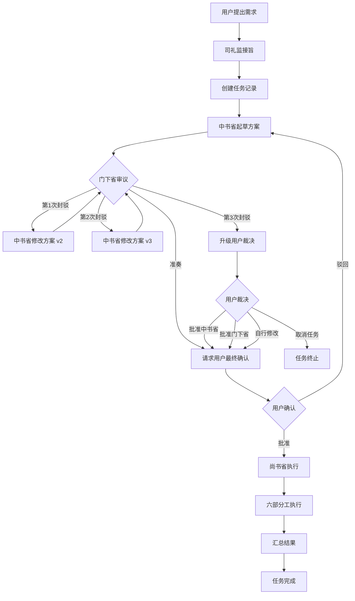

# 三省六部流程规范文档

基于 TASK-20260310-008 项目实践总结

**文档版本**: v1.0
**创建日期**: 2026-03-10
**作者**: 礼部
**来源项目**: 三省六部流程自动化改进 (TASK-20260310-008)

---

## 一、完整工作流程

### 1.1 流程图



### 1.2 状态流转

```
created → planning → reviewing → approved → executing → done
            ↑           ↓
            └─ rejected ─┘
                  ↓ (第3次)
              escalated → approved
```

---

## 二、关键环节与决策点

### 2.1 决策点表格

| 决策点 | 决策者 | 触发条件 | 可选项 | 影响范围 |
|--------|--------|----------|--------|----------|
| **技术路径选择** | 中书省 | 起草方案时 | 多个可行方案 | 影响后续实施复杂度 |
| **封驳/准奏** | 门下省 | 审议方案时 | 准奏 / 封驳 | 是否进入修改循环 |
| **用户裁决** | 用户 | 第3次封驳 | 批准中书省 / 批准门下省 / 自行修改 / 取消任务 | 终止争议 |
| **最终定稿** | 用户 | 准奏后 | 批准执行 / 驳回重做 | 是否开始实施 |
| **子任务分配** | 尚书省 | 执行阶段 | 分配给哪个部门 | 执行效率 |

### 2.2 关键决策原则

#### 中书省方案设计
- **奥卡姆剃刀**: 简单方案优先于复杂架构
- **技术验证**: 技术路径必须在方案中明确,不能留作风险项
- **完整性**: 包含实施步骤、风险评估、回滚方案、验收标准
- **工时估算**: 提供现实的工时评估,不设人为限制

#### 门下省审议标准
1. **可行性**: 技术路径是否验证?依赖是否明确?
2. **完整性**: 是否覆盖实施、测试、回滚?
3. **风险控制**: 是否有降级/回滚方案?
4. **清晰度**: 执行者能否直接按方案实施?
5. **合规性**: 是否符合用户约定和技术规范?

#### 封驳决策树
```
方案有重大缺陷?
├─ 是 → 第1次封驳,说明缺陷
├─ 修改后仍有问题 → 第2次封驳,明确要求
└─ 再次不达标 → 第3次封驳 → 升级用户裁决
```

---

## 三、各部门职责边界

### 3.1 职责表

| 部门 | 核心职责 | 不应做的事 | 关键产出 |
|------|----------|-----------|----------|
| **司礼监** | 流程协调、用户接口、异常升级 | ❌ 不直接规划方案<br>❌ 不直接派发子任务 | 任务记录、用户裁决请求、最终回报 |
| **中书省** | 方案规划、响应封驳 | ❌ 不自行决定技术路径优劣<br>❌ 不跳过审议直接实施 | 详细实施方案、风险评估 |
| **门下省** | 质量审议、封驳不合格方案 | ❌ 不替代中书省写方案<br>❌ 不超过3次封驳 | 审议意见、封驳理由、准奏确认 |
| **尚书省** | 任务拆解、调度执行、汇总结果 | ❌ 不修改方案内容<br>❌ 不跨部门指挥 | 子任务列表、执行结果汇总 |
| **吏部** | Agent 配置、Prompt 优化 | ❌ 不参与业务决策<br>❌ 不修改技术代码 | Agent SOUL.md、配置文件 |
| **户部** | 数据准备、资源管理 | ❌ 不分析业务逻辑<br>❌ 不设计架构 | 数据集、环境配置、依赖清单 |
| **礼部** | 知识提炼、规范制定 | ❌ 不执行实施任务<br>❌ 不做技术评审 | 流程规范、最佳实践、培训文档 |
| **兵部** | 代码编写、技术实现 | ❌ 不自行决定技术方案<br>❌ 不跳过测试 | 代码实现、单元测试 |
| **工部** | 集成测试、部署验证 | ❌ 不修改核心逻辑<br>❌ 不替代刑部审查 | 测试报告、部署清单 |
| **刑部** | 代码审查、质量检查、合规审计 | ❌ 不直接修改代码<br>❌ 不做功能开发 | 审查报告、质量评分、合规清单 |

### 3.2 跨部门协作规则

#### 正常协作流程
```
尚书省 → 分配任务 → 某部
某部 → 完成任务 → 尚书省
尚书省 → 汇总结果 → 司礼监 → 用户
```

#### 质量保障流程
```
兵部完成代码 → 工部测试 → 刑部审查 → 尚书省验收
            ↓                ↓           ↓
         (有问题时)      (有问题时)   (有问题时)
            ↓                ↓           ↓
         退回兵部         退回工部     退回相关部门
```

#### 知识沉淀流程
```
任何部门发现问题 → 报告礼部 → 礼部提炼规范 → 更新 SOUL.md
吏部 → 执行配置修改 → 验证生效
```

---

## 四、可复用流程规范 (SOP)

### 4.1 新需求处理 SOP

#### 步骤 1: 需求接收 (司礼监)
**输入**: 用户需求描述
**动作**:
1. 使用 MCP tool `sansheng_create` 创建任务记录
2. 收集必要上下文 (技术栈、约束条件)
3. 自动触发中书省规划

**产出**: 任务 ID (如 TASK-20260310-008)

**检查点**:
- [ ] 任务记录已创建
- [ ] 上下文信息完整
- [ ] 状态 = `planning`

---

#### 步骤 2: 方案规划 (中书省)
**输入**: 任务 ID + 需求上下文
**动作**:
1. 分析需求,拆解目标
2. 设计实施步骤 (具体到文件、命令)
3. 评估风险,制定应对措施
4. 估算工时,明确依赖
5. 使用 MCP tool `sansheng_submit_plan` 提交方案
6. 自动 handoff 给门下省

**产出**: 详细方案 (v1)

**检查点**:
- [ ] 包含明确的实施步骤
- [ ] 包含风险评估和应对
- [ ] 包含验收标准
- [ ] 技术路径已验证 (不能说"需要验证")

**常见错误**:
- ❌ "方案 A 和方案 B 需要用户选择" → 应该由中书省推荐并说明理由
- ❌ "技术路径待验证" → 应该先验证再提交方案
- ❌ "预计 2-3 小时" → 应该是现实评估,不受人为限制

---

#### 步骤 3: 方案审议 (门下省)
**输入**: 任务 ID + 中书省方案
**动作**:
1. 按 5 维度审查方案 (可行性、完整性、风险控制、清晰度、合规性)
2. 判断:
   - 如果达标 → 使用 MCP tool `sansheng_approve` 准奏 → 触发用户确认
   - 如果不达标 → 使用 MCP tool `sansheng_reject` 封驳 → 返回中书省
   - 如果第3次封驳 → 自动升级司礼监

**产出**: 审议意见 (准奏/封驳)

**检查点**:
- [ ] 审议依据明确
- [ ] 封驳理由具体 (不能只说"不够详细")
- [ ] 建议可操作

**封驳理由模板**:
```
第 N 次封驳理由:

1. [具体问题] - [当前方案的缺陷]
   应改为: [明确的要求]

2. [具体问题] - [当前方案的缺陷]
   应改为: [明确的要求]

建议操作: [下一步应该做什么]
```

---

#### 步骤 4: 用户确认 (司礼监)
**输入**: 准奏后的方案 OR 第3次封驳
**动作**:
1. 如果是准奏 → 请求用户最终确认
2. 如果是第3次封驳 → 请求用户裁决
3. 使用 `AskUserQuestion` 工具
4. 根据用户反馈:
   - 批准 → 使用 `sansheng_approve` 标记,进入执行
   - 驳回 → 返回中书省重新规划
   - 取消 → 任务终止

**产出**: 用户决策记录

**检查点**:
- [ ] 向用户展示完整方案
- [ ] 提供明确选项
- [ ] 记录决策理由

---

#### 步骤 5: 任务执行 (尚书省 + 六部)
**输入**: 已批准的方案
**动作**:
1. 尚书省拆解子任务
2. 根据任务类型分配到相应部门:
   - Agent 配置 → 吏部
   - 数据准备 → 户部
   - 代码实现 → 兵部
   - 集成测试 → 工部
   - 质量审查 → 刑部
3. 各部门并行执行
4. 汇总结果,报告司礼监

**产出**: 实施结果 + 交付物

**检查点**:
- [ ] 所有子任务完成
- [ ] 测试通过
- [ ] 质量审查通过

---

### 4.2 封驳响应 SOP

#### 中书省收到封驳后
**动作**:
1. 仔细阅读封驳理由
2. 识别问题:
   - 技术路径问题 → 重新验证或选择其他路径
   - 完整性问题 → 补充缺失内容
   - 风险控制问题 → 增加应对措施
3. 修改方案,生成新版本
4. 提交方案 v(N+1)
5. 自动 handoff 给门下省

**注意事项**:
- 不要对封驳意见争辩,而是理解其背后的质量要求
- 如果多次封驳,反思是否理解了核心问题
- 可以在方案中说明为何某些建议不采纳 (但要有充分理由)

---

### 4.3 用户裁决 SOP

#### 触发条件
连续 3 次封驳后,中书省和门下省未达成一致

#### 司礼监操作
**动作**:
1. 整理双方观点:
   ```
   【中书省观点】
   - 核心论点
   - 支持理由

   【门下省观点】
   - 核心论点
   - 支持理由
   ```
2. 向用户说明:
   - 争议焦点是什么
   - 双方论据
   - 潜在风险
3. 提供选项:
   - [ ] 采纳中书省方案
   - [ ] 采纳门下省意见
   - [ ] 我自行修改
   - [ ] 取消任务
4. 记录用户决策
5. 通知相关部门执行

---

### 4.4 MCP Tool 使用规范

#### sansheng_create
**用途**: 创建新任务
**调用者**: 司礼监
**参数**:
```typescript
{
  title: string,        // 任务标题
  context: string       // 任务背景和上下文
}
```

**返回**:
```typescript
{
  task_id: string,      // 如 "TASK-20260310-008"
  state: "planning"
}
```

---

#### sansheng_submit_plan
**用途**: 提交方案
**调用者**: 中书省
**参数**:
```typescript
{
  task_id: string,
  plan: string          // Markdown 格式的详细方案
}
```

**返回**:
```typescript
{
  version: number,      // 方案版本号
  state: "reviewing"
}
```

---

#### sansheng_reject
**用途**: 封驳方案
**调用者**: 门下省
**参数**:
```typescript
{
  task_id: string,
  reason: string        // 封驳理由 (详细、具体)
}
```

**返回**:
```typescript
{
  rejection_count: number,
  should_escalate: boolean,  // 是否达到第3次封驳
  state: "rejected" | "escalated"
}
```

---

#### sansheng_approve
**用途**: 准奏方案
**调用者**: 门下省
**参数**:
```typescript
{
  task_id: string,
  note?: string         // 可选的审议意见
}
```

**返回**:
```typescript
{
  state: "approved",
  await_user_confirmation: true
}
```

---

#### sansheng_finalize
**用途**: 最终确认 (用户批准后)
**调用者**: 司礼监
**参数**:
```typescript
{
  task_id: string,
  approved_by: "user",
  final_plan?: string   // 用户修改后的最终方案 (可选)
}
```

**返回**:
```typescript
{
  state: "executing",
  ready_for_execution: true
}
```

---

## 五、经验教训

### 5.1 架构设计教训

#### 教训 1: 不要误解真实痛点
**案例**: TASK-20260310-008 第3次封驳
**错误**: 以为痛点是"手动输入 @agent",实际痛点是每次 Agent 切换需要用户界面点击授权
**正确做法**:
- 深入理解用户痛点的本质
- 区分"表面现象"和"根本原因"
- 在方案设计前先与用户确认理解是否正确

**规范化**:
- 中书省在起草方案前,必须在"现状分析"中明确:
  - 当前痛点是什么
  - 自动化后能节省什么成本
  - 用户的核心诉求是什么

---

#### 教训 2: 技术路径必须验证后再提交
**案例**: TASK-20260310-008 第1-2次封驳
**错误**: 方案中写"Agent 调用方式 (MCP API? bash?) 尚未明确,作为风险项"
**正确做法**:
- 技术路径必须在方案设计前验证
- 不能把"待验证"作为风险项写进方案
- 如果确实有多个选项,应该先验证可行性,再提供推荐方案

**规范化**:
- 门下省审议时,如果看到"待验证"、"需要确认"等字眼,直接封驳
- 中书省提交方案前,自检清单必须包含: "所有技术路径是否已验证?"

---

#### 教训 3: 不要设计用户不需要的复杂交互
**案例**: TASK-20260310-008 v4 方案
**错误**: 设计了 3 个 MCP tool,每个都返回详细信息,以为用户想看到"中书省方案"、"门下省结果"
**正确做法**:
- 理解用户关心的粒度: 正常路径只需进度提示,异常路径才需要详细信息
- 用户体验: "审议中..." → "审议完成" → 最终方案,不需要中间过程

**规范化**:
- 中书省在方案中必须明确:
  - 哪些信息用户需要看到
  - 哪些信息是后台流转,用户不关心
- 门下省审议时,检查"用户体验"维度

---

#### 教训 4: 不要依赖可能被卸载的外部插件
**案例**: TASK-20260310-008 第5次封驳
**错误**: v3 方案提到"参考 dev-flow 实现",但 dev-flow 可能被用户卸载
**正确做法**:
- 核心功能必须独立实现
- 可以学习其他插件的思路,但不能依赖其存在
- 在"依赖清单"中明确列出所有外部依赖

**规范化**:
- 中书省必须在方案中列出"依赖清单"
- 门下省审议时,检查是否有不可控的外部依赖

---

#### 教训 5: 不要设置不合理的时间限制
**案例**: TASK-20260310-008 第6次封驳
**错误**: v3 方案说"每个子任务预计 2-3 小时",但实际复杂度不止
**正确做法**:
- 工时估算要基于真实复杂度
- 不设置人为的时间上限
- 可以分阶段交付,但每个阶段的工时要合理

**规范化**:
- 中书省工时估算必须说明依据
- 门下省审议时,检查工时是否合理 (不能明显低估)

---

### 5.2 流程机制教训

#### 教训 6: 司礼监不应直接派发任务
**案例**: 早期设计中,司礼监直接指挥六部
**错误**: 绕过了尚书省的统筹协调职责
**正确做法**:
- 司礼监 → 尚书省 → 六部
- 司礼监只负责流程协调和用户接口,不直接管理执行

**规范化**:
- 在司礼监 SOUL.md 中明确: "不直接派发子任务,交由尚书省统筹"
- 如果发现跨层级指挥,门下省应在审议时指出

---

#### 教训 7: 封驳必须具体,不能泛泛而谈
**案例**: 某次封驳只说"规划不够详细"
**错误**: 中书省不知道具体哪里不详细,无从改起
**正确做法**:
- 封驳理由必须指出具体问题
- 提供明确的改进方向
- 格式: "问题 → 当前不足 → 应该如何改"

**规范化**:
- 在门下省 SOUL.md 中提供"封驳理由模板"
- 刑部在审查封驳质量时,检查是否具体

---

#### 教训 8: 用户确认必不可少
**案例**: 准奏后必须请求用户最终确认,第3次封驳后必须请求用户裁决
**重要性**:
- 防止 AI 自行决策重大变更
- 保证用户对最终方案的控制权
- 在争议时,用户是最高裁决者

**规范化**:
- 在司礼监 SOUL.md 中明确: "准奏后必须 AskUserQuestion"
- 在任务状态机中,`approved` 状态必须包含 `approval.approved_by = "user"`

---

#### 教训 9: 质量检查不能跳过
**案例**: TASK-20260310-030 发现 sansheng_finalize 工具缺失
**错误**: 工部完成集成测试后,未经刑部审查就认为完成
**正确做法**:
- 任何交付前必须经过刑部审查
- 刑部检查: 功能完整性、测试覆盖率、代码质量
- 发现 P0 问题必须立即修复

**规范化**:
- 尚书省在分配任务时,必须包含"刑部审查"子任务
- 工部完成后,不能直接汇总,必须等刑部审查通过

---

#### 教训 10: 方案设计要考虑实现细节
**案例**: v1-v2 方案只说"修改 SOUL.md",未说明具体改什么
**错误**: 执行时发现无法落地,因为缺少关键细节
**正确做法**:
- 方案必须细化到"改哪个文件的哪一行"
- 包含伪代码或示例代码
- 说明配置参数的具体值

**规范化**:
- 中书省方案模板必须包含"实施细节"章节
- 门下省审议时,检查"执行者能否直接按方案操作"

---

### 5.3 协作沟通教训

#### 教训 11: 版本迭代要保留上下文
**案例**: 方案从 v1 到 v6,每个版本都记录了修改理由
**价值**:
- 后续维护时可以理解为什么这么设计
- 避免重复犯错
- 为新 Agent 提供学习案例

**规范化**:
- 每个方案版本必须说明: "相比上一版,改了什么,为什么改"
- 礼部在提炼经验时,必须关联具体版本

---

#### 教训 12: 争议升级机制很重要
**案例**: 如果没有"第3次封驳 → 升级用户"机制,中书省和门下省可能无限循环
**价值**:
- 防止 AI 之间陷入争议死循环
- 保证用户是最终决策者
- 记录争议历史,供后续参考

**规范化**:
- 任何可能产生分歧的环节,都要设计升级机制
- 升级条件要明确 (如 "连续 N 次封驳")

---

## 六、检查清单

### 6.1 方案提交前自检 (中书省)

- [ ] 包含"现状分析",说明当前痛点
- [ ] 包含"目标拆解",说明要达成什么
- [ ] 包含"执行步骤",细化到具体文件/命令
- [ ] 包含"风险评估",列出可能的问题和应对
- [ ] 包含"验收标准",明确如何判断完成
- [ ] 所有技术路径已验证,不存在"待确认"
- [ ] 工时估算合理,基于真实复杂度
- [ ] 依赖清单完整,不依赖可能被卸载的外部插件
- [ ] 用户体验合理,不设计不必要的复杂交互

### 6.2 审议时检查 (门下省)

- [ ] 可行性: 技术路径验证了吗?依赖明确了吗?
- [ ] 完整性: 是否覆盖实施、测试、回滚?
- [ ] 风险控制: 是否有降级/回滚方案?
- [ ] 清晰度: 执行者能否直接按方案实施?
- [ ] 合规性: 是否符合用户约定和技术规范?
- [ ] 用户体验: 交互是否合理?信息粒度是否恰当?

### 6.3 执行前检查 (尚书省)

- [ ] 方案已通过门下省审议
- [ ] 用户已最终确认
- [ ] 所有依赖已准备就绪
- [ ] 子任务分配合理
- [ ] 包含质量审查环节 (刑部)

### 6.4 交付前检查 (刑部)

- [ ] 功能完整性: 是否实现了方案的所有要求?
- [ ] 测试覆盖率: 是否有充分的单元测试和集成测试?
- [ ] 代码质量: 是否符合代码规范?是否有明显 bug?
- [ ] 文档完整性: 是否有必要的使用说明?
- [ ] 依赖管理: package.json / requirements.txt 是否完整?

---

## 七、模板库

### 7.1 中书省方案模板

```markdown
# [任务标题] 实施方案 vX

## 一、现状分析

**当前痛点**:
- [具体痛点 1]
- [具体痛点 2]

**自动化后收益**:
- [收益 1]
- [收益 2]

## 二、目标拆解

主目标: [一句话描述]

子目标:
1. [子目标 1]
2. [子目标 2]

## 三、技术选型

**选型对比**:

| 方案 | 优点 | 缺点 | 适用场景 |
|------|------|------|---------|
| 方案 A | ... | ... | ... |
| 方案 B | ... | ... | ... |

**推荐方案**: [方案 X]

**推荐理由**: [为什么选这个方案]

## 四、执行步骤

### 步骤 1: [步骤名称]

**具体动作**:
1. [动作 1 - 具体到文件路径/命令]
2. [动作 2]

**预期产出**: [输出什么]

**验证方式**: [如何确认完成]

**预计工时**: [X-Y 小时]

### 步骤 2: [步骤名称]
...

## 五、风险评估

| 风险 | 概率 | 影响 | 应对措施 |
|------|------|------|---------|
| [风险 1] | 中 | 高 | [具体应对] |
| [风险 2] | 低 | 中 | [具体应对] |

## 六、回滚方案

如果实施失败,回滚步骤:
1. [回滚动作 1]
2. [回滚动作 2]

## 七、验收标准

- [ ] [标准 1 - 可验证]
- [ ] [标准 2 - 可验证]

## 八、依赖清单

**外部依赖**:
- [依赖 1] (版本要求)
- [依赖 2]

**前置条件**:
- [条件 1]
- [条件 2]

## 九、总工时估算

总计: [X-Y 小时]

分解:
- 步骤 1: [A 小时]
- 步骤 2: [B 小时]
- 测试验证: [C 小时]
```

---

### 7.2 门下省封驳理由模板

```markdown
第 [N] 次封驳理由:

## 不达标维度

### 1. [维度名称，如"可行性"]

**问题**: [具体指出哪里有问题]

**当前方案的不足**: [引用方案中的具体内容]

**应改为**: [明确的改进要求]

### 2. [维度名称]

**问题**: ...

**应改为**: ...

## 建议操作

[下一步应该做什么]

## 审议依据

- [引用的规范条款]
- [类似案例参考]
```

---

### 7.3 司礼监用户裁决请求模板

```markdown
任务 [TASK-ID] 已达第 3 次封驳,需要您的裁决

## 争议焦点

[一句话描述争议的核心问题]

## 双方观点

### 中书省观点

**立场**: [中书省的主张]

**支持理由**:
1. [理由 1]
2. [理由 2]

**潜在风险**: [如果采纳中书省,可能的风险]

### 门下省观点

**立场**: [门下省的主张]

**支持理由**:
1. [理由 1]
2. [理由 2]

**潜在风险**: [如果采纳门下省,可能的风险]

## 历史版本

- v1: [简述] → 封驳理由: [...]
- v2: [简述] → 封驳理由: [...]
- v3: [简述] → 封驳理由: [...]

## 请您裁决

请选择:
- [ ] 采纳中书省方案 (方案 vX)
- [ ] 采纳门下省意见 (要求中书省按意见修改)
- [ ] 我自行修改方案 (请提供修改内容)
- [ ] 取消任务
```

---

## 八、度量指标

### 8.1 流程效率指标

| 指标 | 计算方式 | 目标值 |
|------|----------|--------|
| **封驳率** | 封驳次数 / 总任务数 | < 30% |
| **一次通过率** | 第一次审议通过的任务数 / 总任务数 | > 60% |
| **升级率** | 需要用户裁决的任务数 / 总任务数 | < 5% |
| **平均轮次** | 总审议轮次 / 总任务数 | < 1.5 |

### 8.2 质量指标

| 指标 | 计算方式 | 目标值 |
|------|----------|--------|
| **方案完整性** | 包含所有必需章节的方案数 / 总方案数 | > 95% |
| **测试覆盖率** | 已测试代码行数 / 总代码行数 | > 80% |
| **P0 问题率** | P0 问题数 / 总交付数 | < 5% |

---

## 九、未来改进方向

基于 TASK-20260310-008 的经验,未来可以改进的方向:

### 9.1 短期改进 (v0.2)

1. **尚书省自动执行**: 实现子任务自动派发和结果汇总
2. **六部协作**: 完善各部门的职责和 SOUL.md
3. **状态可视化**: 提供实时的任务流转状态

### 9.2 中期改进 (v0.3)

1. **方案模板库**: 为常见任务提供预设方案
2. **智能封驳**: 门下省根据历史封驳案例,自动识别常见问题
3. **知识库**: 礼部维护的最佳实践和反模式库

### 9.3 长期改进 (v0.4+)

1. **统计分析**: 封驳率、平均耗时、质量趋势分析
2. **性能优化**: 异步执行、并行审议
3. **Web Dashboard**: 实时查看任务流转的可视化界面

---

## 十、附录

### 10.1 TASK-20260310-008 完整历程

| 版本 | 创建时间 | 作者 | 结果 | 关键变化 |
|------|----------|------|------|---------|
| v1 | 2026-03-10 13:29 | 中书省 | 封驳 | 初始方案: workflow.py + SOUL 修改 |
| v2 | 2026-03-10 13:33 | 中书省 | 封驳 | 仍然是 workflow.py,未改变技术路径 |
| v3 | 2026-03-10 13:42 | 中书省 | 封驳 (用户) | 用户指出根本性错误: 应该用 MCP Server |
| v4 | 2026-03-10 13:53 | 中书省 | 封驳 (用户) | Node.js + MCP,但信息粒度不对 |
| v5 | 2026-03-10 14:05 | 中书省 | 封驳 (用户) | 调整信息粒度,但依赖 dev-flow |
| v6 | 2026-03-10 14:57 | 中书省 | 准奏 → 批准 | 独立实现,去除时间限制,执行状态可见 |

**总封驳次数**: 9 次 (其中用户裁决 5 次)
**最终工时**: 无限制 (分阶段交付)
**关键突破**: 从 Agent handoff 改为 MCP Server 后台服务

### 10.2 关键里程碑

1. **2026-03-10 13:20** - 任务创建
2. **2026-03-10 13:42** - 用户第1次介入,指出技术路径错误
3. **2026-03-10 14:05** - 中书省理解 MCP Server 方案
4. **2026-03-10 14:57** - 方案 v6 通过审议
5. **2026-03-10 15:01** - 用户最终批准
6. **2026-03-10 15:04** - sansheng_finalize 工具测试通过
7. **2026-03-10 15:07** - 刑部发现 P0 问题并修复

---

## 十一、结语

本规范基于真实项目 TASK-20260310-008 的 6 个版本、9 次封驳、5 次用户介入的经验总结而成。

**核心价值**:
- 将临时性经验固化为永久性规范
- 为新任务提供可复用的流程模板
- 记录经验教训,避免重复犯错
- 明确各部门职责边界,提升协作效率

**使用建议**:
- 新任务开始前,阅读相关 SOP
- 执行过程中,参考检查清单
- 遇到问题时,查阅经验教训
- 完成任务后,向礼部反馈改进建议

**持续迭代**:
本规范将随着更多项目实践不断完善。欢迎所有部门提供反馈和改进建议。

---

**文档维护者**: 礼部
**最后更新**: 2026-03-10
**下次审阅**: 2026-04-10 (每月审阅一次)
