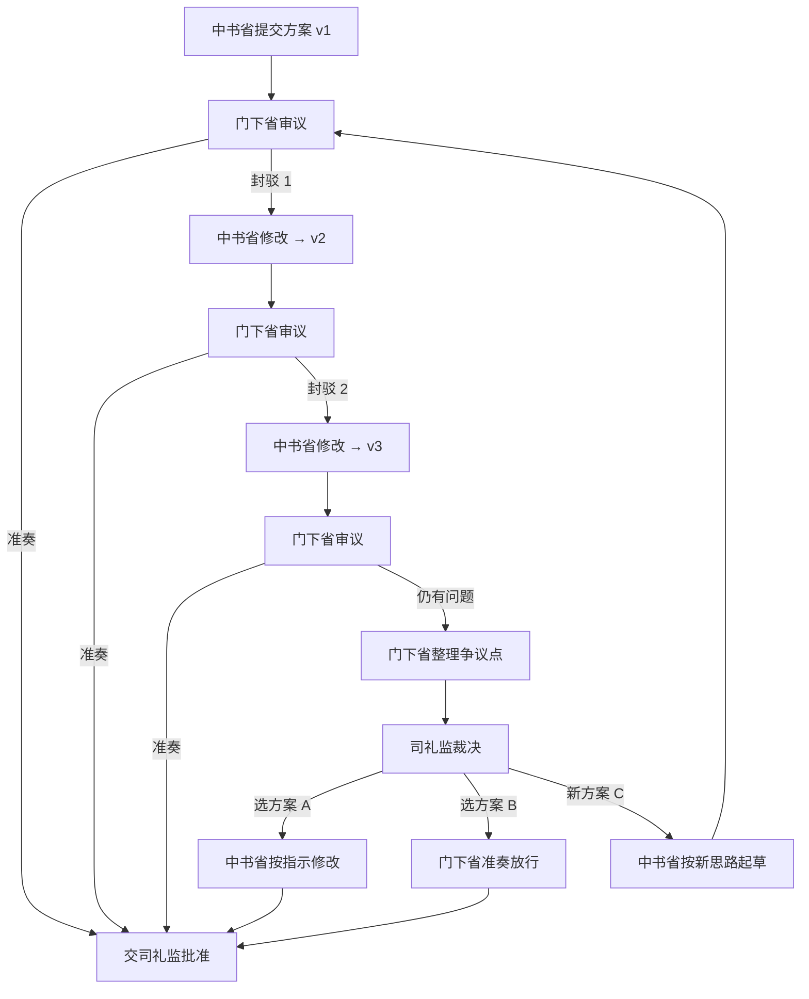

# 三省审议裁决流程

## 一、触发条件

当任务在三省审议过程中出现以下情况时，启动裁决流程：

1. **封驳次数达到上限**：门下省对同一任务连续封驳 2 次
2. **根本性分歧**：中书省和门下省在技术路线、架构选择、风险评估等方面存在无法调和的观点差异
3. **紧急任务滞留**：高优先级任务因审议僵持而延误

**设计原则**：裁决是例外流程，不是常规路径。大部分任务应在 1-2 次封驳内达成共识。

---

## 二、流程图



**流程关键节点**：
- **v1-v2**：第一次封驳，中书省修正细节问题
- **v2-v3**：第二次封驳，中书省尝试妥协方案
- **v3 仍被封驳**：触发裁决流程
- **司礼监介入**：整理双方观点，由用户（帝王）做最终决策

---

## 三、争议点整理模板

当门下省准备提交裁决申请时，必须使用以下模板整理争议点：

```markdown
# 任务 {task_id} 裁决申请

## 争议概况
- 任务：{task_title}
- 封驳次数：2
- 核心分歧：{core_conflict}

## 双方观点

### 门下省观点
1. {menxia_point_1}
   - 理由：{reason}
   - 风险：{risk}

2. {menxia_point_2}
   - 理由：{reason}

### 中书省观点
1. {zhongshu_point_1}
   - 理由：{reason}
   - 依据：{evidence}

2. {zhongshu_point_2}
   - 理由：{reason}

## 裁决选项

**选项 A：采纳门下省意见**
- 动作：{action}
- 优点：{pros}
- 缺点：{cons}

**选项 B：采纳中书省方案**
- 动作：{action}
- 优点：{pros}
- 缺点：{cons}

**选项 C：折中方案**
- 动作：{action}
- 优点：{pros}

## 建议
{recommendation}

---
请用户裁决：选择 A / B / C，或给出新方向
```

**模板使用说明**：
- **争议概况**：用一句话说清楚双方在争什么
- **双方观点**：客观还原两方的推理链，不带倾向性
- **裁决选项**：必须提供至少 2 个可执行方案，优缺点对比要诚实
- **建议**：司礼监可以给出倾向性建议，但不能代替用户决策

---

## 四、操作步骤

### 4.1 门下省职责

**触发裁决的判断标准**：
- 已经封驳 2 次
- 最新版本（v3）仍存在无法接受的问题
- 双方在关键问题上观点对立，无法通过修改文字达成共识

**操作流程**：
1. 在第 2 次封驳的审议意见中明确说明："此问题涉及根本性分歧，建议提交司礼监裁决"
2. 使用争议点整理模板，梳理双方观点
3. 提炼出 2-3 个可执行的裁决选项（A/B/C）
4. 将整理好的裁决申请提交给司礼监

**质量要求**：
- 必须客观公正，不能通过措辞误导用户
- 必须提供可执行的具体方案，不能只抛问题
- 如果有历史类似案例，需引用作为参考

### 4.2 司礼监职责

**接收裁决申请后的操作**：
1. 检查裁决申请的完整性（是否包含所有必需字段）
2. 验证封驳次数（确实达到 2 次）
3. 审查选项 A/B/C 的可行性
4. 如有需要，补充技术背景说明
5. 将裁决申请呈报给用户

**呈报格式**：
```
【裁决申请】任务 {task_id}

{粘贴整理好的争议点模板}

请您选择：
A - 采纳门下省意见（保守路线）
B - 采纳中书省方案（激进路线）
C - 折中方案
D - 给出新方向（请描述）
```

### 4.3 用户裁决

**用户可选操作**：
- **选 A**：门下省观点正确，中书省需按门下省要求修改
- **选 B**：中书省方案可行，门下省放行
- **选 C**：采用司礼监提供的折中方案
- **选 D**：双方都有问题，给出新的技术方向

**裁决后的记录**：
- 裁决决定会被记录在任务历史中
- 类似争议再次出现时，可引用历史裁决
- 如果裁决证明是错误的（事后发现问题），需记录在案例库

### 4.4 后续流转

**选项 A（采纳门下省意见）**：
- 中书省收到裁决后，按门下省要求生成 v4
- v4 直接提交门下省，门下省必须准奏放行
- 流转到司礼监审批

**选项 B（采纳中书省方案）**：
- 门下省直接对 v3 准奏放行
- 流转到司礼监审批

**选项 C（折中方案）**：
- 中书省按折中方案修改，生成 v4
- v4 提交门下省，门下省准奏放行
- 流转到司礼监审批

**选项 D（新方向）**：
- 用户给出新的技术方案或架构思路
- 中书省按新方向重新起草，生成 v1'
- 重新进入三省审议流程（从门下省开始）

**重要约定**：
- 裁决后的版本，门下省不得再次封驳（除非发现明显的实现错误）
- 如果裁决后仍有问题，只能在执行阶段发现后再处理

---

## 五、案例示例

### 案例：API 超时处理策略争议

**任务背景**：
- 任务 ID：TASK-035
- 任务内容：实现第三方 API 调用模块
- 封驳次数：2

**争议概况**：
中书省提出使用指数退避重试策略，门下省认为超时应直接失败，不应重试。

---

**争议点整理**：

```markdown
# 任务 TASK-035 裁决申请

## 争议概况
- 任务：实现第三方 API 调用模块
- 封驳次数：2
- 核心分歧：API 超时后是否应自动重试

## 双方观点

### 门下省观点
1. API 超时应直接返回失败，由上层业务决定是否重试
   - 理由：调用方最了解业务语义，有些操作不应重试（如支付）
   - 风险：自动重试可能导致重复扣款、重复提交订单

2. 超时时间应保守设置（3 秒）
   - 理由：避免用户长时间等待
   - 风险：过长的超时会影响用户体验

### 中书省观点
1. 网络抖动是常见问题，应实现指数退避重试
   - 理由：临时性网络问题占 API 失败的 60%，重试能提高成功率
   - 依据：Google SRE 最佳实践

2. 超时时间应设置为 10 秒
   - 理由：第三方 API 文档建议超时设置为 10 秒
   - 依据：API 提供商的官方文档

## 裁决选项

**选项 A：采纳门下省意见**
- 动作：移除重试逻辑，超时 3 秒，直接返回失败
- 优点：逻辑简单，不会产生重复操作风险
- 缺点：因临时网络问题导致的失败率可能较高

**选项 B：采纳中书省方案**
- 动作：实现指数退避重试，超时 10 秒，最多重试 3 次
- 优点：提高成功率，对用户更友好
- 缺点：需要调用方确保接口幂等性

**选项 C：折中方案**
- 动作：实现可配置的重试策略，默认不重试，超时 5 秒
- 优点：既保留扩展性，又避免默认行为的风险

## 建议
建议选择方案 C。重试策略应该是可选功能，由调用方根据业务场景决定是否启用。默认保守行为（不重试）可以避免意外问题，同时为需要高可用的场景预留扩展点。

---
请用户裁决：选择 A / B / C，或给出新方向
```

---

**用户裁决**：
选择 C

**后续流转**：
1. 中书省生成 v4，实现可配置重试策略
2. v4 代码结构：
   ```python
   def call_api(url, timeout=5, retry_policy=None):
       if retry_policy:
           return _call_with_retry(url, timeout, retry_policy)
       else:
           return _call_once(url, timeout)
   ```
3. 门下省审查 v4，确认实现符合裁决，准奏放行
4. 流转司礼监批准执行

---

## 六、常见问题

### Q1：能否跳过第 2 次封驳，直接提交裁决？
不能。必须给中书省充分的修改机会。只有当双方确实存在无法调和的分歧时才启动裁决。

### Q2：如果用户裁决后发现问题怎么办？
裁决后的版本如果在执行中发现问题，按正常 Bug 修复流程处理，不重新裁决。

### Q3：司礼监可以直接决定选 A 还是 B 吗？
不能。司礼监只能整理争议点和提供建议，最终决策权在用户。

### Q4：裁决案例会被记录吗？
会。所有裁决案例会被记录在 `~/.claude/plugins/sansheng-pipeline/data/escalation_cases.jsonl`，供后续参考。

---

## 七、文档版本

- 版本：v1.0
- 创建日期：2026-03-10
- 维护部门：礼部
- 最后更新：2026-03-10
