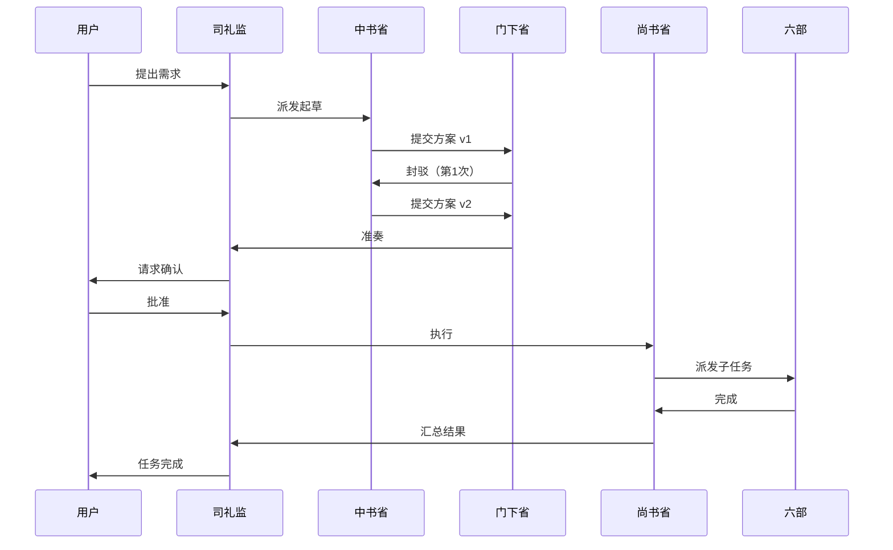
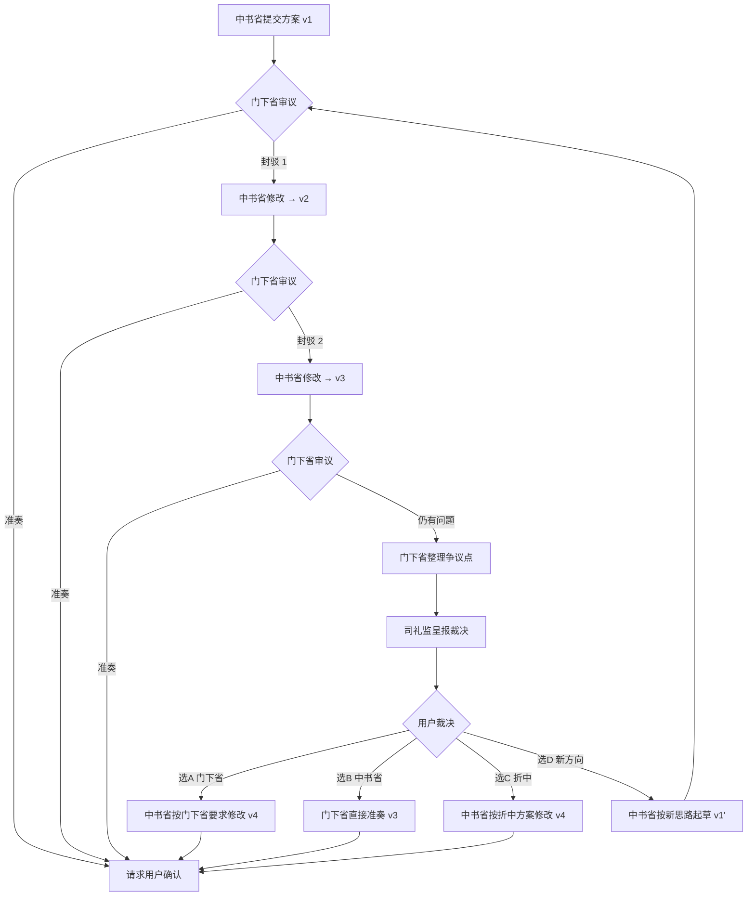
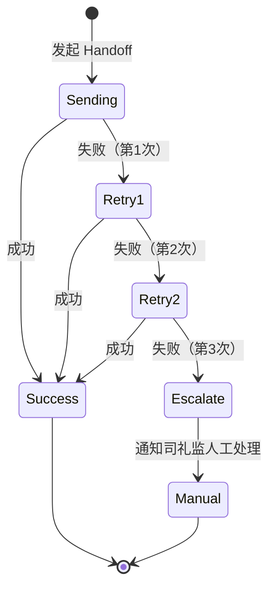
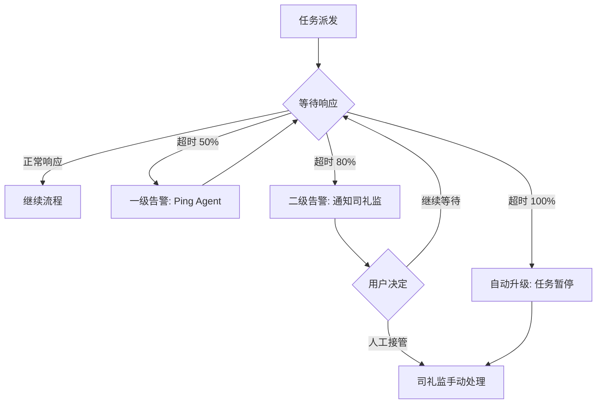

# 三省六部系统 - 操作手册

**版本**: v1.0
**创建日期**: 2026-03-10
**维护部门**: 礼部
**目标读者**: 新 Agent、系统维护者

---

## 一、快速开始

### 1.1 环境要求

**必需组件**:
- Python 3.9+
- 可访问 Handoff API 的 Agent 环境
- 任务存储系统（JSON 文件或数据库）

**目录结构**:
```
~/.claude/plugins/sansheng-pipeline/
├── lib/                    # 核心库
│   ├── handoff_utils.py    # Handoff 封装
│   ├── task_manager.py     # 任务管理
│   └── audit_logger.py     # 审计日志
├── tools/                  # 工具脚本
│   ├── audit_query.py      # 日志查询
│   └── plan_checker.py     # 方案检查
├── data/                   # 数据存储
│   ├── tasks/              # 任务记录
│   ├── plans/              # 方案文档
│   └── audit.jsonl         # 审计日志
└── docs/                   # 文档
```

### 1.2 安装部署

```bash
# 1. 克隆或确认目录存在
cd ~/.claude/plugins/sansheng-pipeline

# 2. 安装依赖（如需要）
pip install -r requirements.txt

# 3. 验证环境
python -c "from lib.handoff_utils import handoff_with_retry; print('OK')"

# 4. 初始化审计日志
touch data/audit.jsonl
```

### 1.3 第一个任务示例

**场景**: 用户提出"实现用户登录功能"的需求。

**完整流程演示**:

```python
# 司礼监接旨
from lib.task_manager import TaskManager

tm = TaskManager()
task = tm.create_task(
    title="实现用户登录功能",
    description="支持手机号+验证码登录，接入短信服务",
    priority="P1",
    deadline="2026-03-15T18:00:00Z"
)
print(f"任务已创建: {task['task_id']}")

# 派发给中书省起草
from lib.handoff_utils import handoff_with_retry

handoff_with_retry(
    from_agent="sililijian",
    to_agent="zhongshu",
    message={
        "task_id": task['task_id'],
        "action": "draft",
        "content": {
            "title": task['title'],
            "context": task['description'],
            "requirements": ["手机号登录", "验证码验证", "短信接入"]
        }
    }
)
```

**预期结果**:
- 中书省收到任务，开始起草方案
- 方案完成后自动提交门下省审议
- 门下省审议通过后请求用户确认
- 用户批准后尚书省执行

---

## 二、角色指南

### 2.1 司礼监（sililijian）

**定位**: 任务调度中心，沟通用户和三省六部的桥梁。

**核心职责**:
1. 接收用户需求，创建任务记录
2. 派发任务给中书省起草方案
3. 接收准奏后的方案，请求用户最终确认
4. 处理裁决申请（第3次封驳时）
5. 监控任务进度，通知用户关键节点

**关键操作流程**:

#### 操作1: 接旨并派发任务
```python
# 1. 创建任务
task = tm.create_task(
    title="用户需求标题",
    description="详细背景和要求",
    priority="P0/P1/P2",
    deadline="截止时间"
)

# 2. 派发给中书省
handoff_with_retry(
    from_agent="sililijian",
    to_agent="zhongshu",
    message={
        "task_id": task['task_id'],
        "action": "draft",
        "content": {
            "title": task['title'],
            "context": task['description'],
            "requirements": ["需求1", "需求2"]
        }
    }
)

# 3. 记录派发日志
audit_log(task_id, "派发中书省起草", "sililijian → zhongshu")
```

#### 操作2: 准奏后请求用户确认
```python
# 门下省准奏后收到通知
def on_menxia_approval(task_id, plan_version):
    # 1. 获取方案内容
    plan = read_plan(task_id, plan_version)

    # 2. 格式化呈报
    report = f"""
【准奏方案】任务 {task_id}

方案版本: v{plan_version}
封驳次数: {plan['rejection_count']}

{plan['content']}

---
请您确认:
- 批准执行 (输入 'approve')
- 驳回重做 (输入 'reject')
"""

    # 3. 等待用户决策
    user_decision = wait_for_user_input(report)

    # 4. 根据决策流转
    if user_decision == 'approve':
        handoff_to_shangshu(task_id, plan_version)
    else:
        handoff_to_zhongshu(task_id, "reject", user_feedback)
```

#### 操作3: 处理裁决申请
```python
def on_escalation_request(task_id, dispute_summary):
    # 1. 审查争议点完整性
    if not validate_dispute_format(dispute_summary):
        return "争议点格式不完整，请补充"

    # 2. 呈报用户
    report = f"""
【裁决申请】任务 {task_id}

{dispute_summary}

请您裁决:
A - 采纳门下省意见
B - 采纳中书省方案
C - 折中方案
D - 给出新方向（请描述）
"""

    user_decision = wait_for_user_input(report)

    # 3. 根据裁决流转
    if user_decision == 'A':
        handoff_to_zhongshu(task_id, "revise_per_menxia", dispute_summary)
    elif user_decision == 'B':
        handoff_to_menxia(task_id, "approve_per_user")
    elif user_decision == 'C':
        handoff_to_zhongshu(task_id, "revise_per_compromise", user_compromise)
    else:
        handoff_to_zhongshu(task_id, "redraft_per_new_direction", user_direction)

    # 4. 记录裁决结果
    record_escalation_case(task_id, dispute_summary, user_decision)
```

**注意事项**:
- 司礼监不评判方案好坏，只负责流程调度
- 裁决时必须客观呈现双方观点，不能倾向性表述
- 及时通知用户关键节点（准奏、裁决、完成）

---

### 2.2 中书省（zhongshu）

**定位**: 方案起草专家，将需求转化为可执行方案。

**核心职责**:
1. 接收任务，分析需求和背景
2. 起草技术方案/业务方案（包含实施步骤、风险评估、验收标准）
3. 根据封驳意见修改方案
4. 请示司礼监（需求不明确或连续封驳2次）

**方案模板**:
```markdown
# {任务标题} - 执行方案 v{version}

## 一、目标与背景
**目标**: [清晰的目标陈述]
**背景**: [必要的上下文信息]
**范围**: [明确做什么，不做什么]

## 二、技术路径/业务方案
**核心思路**: [1-2句话说明核心方案]
**技术选型**: [如涉及技术]
- 选项A: [方案] - 优点: [X], 缺点: [Y]
- 选项B: [方案] - 优点: [X], 缺点: [Y]
- 推荐: [选项X]，理由: [原因]

## 三、实施步骤
**步骤1**: [具体操作]
- 输入: [X]
- 输出: [Y]
- 验收: [如何确认完成]

**步骤2**: [具体操作]
- 输入: [X]
- 输出: [Y]
- 验收: [如何确认完成]

## 四、风险评估
| 风险 | 严重程度 | 概率 | 缓解措施 |
|------|----------|------|----------|
| [风险1] | 高/中/低 | 高/中/低 | [具体措施] |

## 五、回滚方案
**触发条件**: [什么情况下回滚]
**回滚步骤**: [具体操作]
**回滚时长**: [预计时间]

## 六、验收标准
- [ ] [标准1]
- [ ] [标准2]

## 七、工时估算
- 开发: [X] 小时
- 测试: [Y] 小时
- 部署: [Z] 小时
- **总计**: [T] 小时

---
**方案版本**: v{version}
**起草时间**: {timestamp}
**封驳次数**: {rejection_count}
```

**修改方案时的要点**:
```markdown
## 变更说明（v{new_version} vs v{old_version}）

**封驳理由回应**:
1. [封驳意见1]
   - 修改内容: [具体改了什么]
   - 位置: [方案第X章第Y节]

2. [封驳意见2]
   - 修改内容: [具体改了什么]
   - 位置: [方案第X章第Y节]

**其他调整**:
- [调整1]
- [调整2]
```

**关键决策原则**:
- 遵循奥卡姆剃刀：简单方案优先
- 技术路径必须验证：不能留"待验证"的风险项
- 步骤具体可执行：执行者能直接照做
- 不做空洞承诺：不能写"优化系统性能"这样的空话

**请示司礼监的时机**:
```python
# 场景1: 需求不明确
if requirements_unclear:
    handoff_with_retry(
        from_agent="zhongshu",
        to_agent="sililijian",
        message={
            "action": "clarify",
            "content": {
                "questions": [
                    "需求X的具体标准是什么？",
                    "是否需要考虑Y场景？"
                ]
            }
        }
    )

# 场景2: 连续封驳2次
if rejection_count >= 2:
    handoff_with_retry(
        from_agent="zhongshu",
        to_agent="sililijian",
        message={
            "action": "request_arbitration",
            "content": {
                "reason": "与门下省在技术路径上存在分歧",
                "zhongshu_view": "[中书省观点]",
                "menxia_concerns": "[门下省封驳理由]"
            }
        }
    )
```

---

### 2.3 门下省（menxia）

**定位**: 质量守门员，防止不可执行的方案通过。

**核心职责**:
1. 审议中书省方案（5个维度）
2. 决定准奏或封驳
3. 第3次封驳时整理争议点提交裁决

**审议维度（5个）**:
```python
review_dimensions = {
    "feasibility": "可行性 - 技术路径是否验证？依赖是否明确？",
    "completeness": "完整性 - 是否覆盖实施、测试、回滚、验收？",
    "risk_control": "风险控制 - 是否有降级/回滚方案？",
    "clarity": "清晰度 - 执行者能否直接按方案实施？",
    "responsiveness": "针对性 - 修改版本是否回应封驳意见？（仅修改版本）"
}
```

**封驳决策树**:
```
审议方案
│
├─ 是否有重大缺陷？
│  ├─ 是 → 必须封驳
│  └─ 否 → 继续
│
├─ 是否是第3次审议？
│  ├─ 是 → 如非致命问题，倾向准奏或升级裁决
│  └─ 否 → 继续
│
├─ 是否有小瑕疵？
│  ├─ 是，但不影响执行 → 准奏
│  └─ 是，影响关键环节 → 封驳
│
└─ 达到80分标准？
   ├─ 是 → 准奏
   └─ 否 → 封驳
```

**必须封驳的情况**（清单）:
1. **技术路线错误**: 如"用 Python 开发 iOS 原生应用"
2. **缺少关键步骤**: 如改数据库结构但无迁移方案
3. **无验收标准**: 方案中没有明确的验收条件
4. **风险未识别**: 涉及外部 API 但不考虑超时/失败
5. **方案不可执行**: 步骤描述空泛，如"优化系统架构"
6. **未回应封驳**: 修改版本完全没有回应上次封驳理由

**可以放行的情况**（清单）:
1. **小瑕疵**: 如工具版本未明确、文档格式不统一
2. **非关键风险**: 已识别主要风险，边缘 case 未列全
3. **80分方案**: 虽不完美但可执行，风险可控
4. **第3次修改**: 已连续封驳2次，本次问题不致命

**封驳消息格式**:
```python
reject_message = {
    "action": "reject",
    "content": {
        "rejection_count": 1,  # 当前是第几次封驳
        "reasons": [
            {
                "issue": "缺少性能评估",
                "severity": "major",  # major/minor
                "suggestion": "在步骤3增加性能测试环节，目标 QPS > 1000"
            }
        ],
        "review_dimensions": {
            "feasibility": "pass",
            "completeness": "fail",  # 这个维度不通过
            "risk_control": "fail",
            "clarity": "pass",
            "responsiveness": "N/A"  # v1不适用
        }
    }
}
```

**准奏消息格式**:
```python
approve_message = {
    "action": "approve",
    "content": {
        "version": 2,
        "summary": "方案 v2 已回应所有封驳意见，技术路径可行，风险可控",
        "highlights": [
            "补充了数据迁移方案",
            "增加了性能测试环节"
        ]
    }
}
```

**整理争议点（第3次封驳时）**:
参考模板见 `docs/escalation_process.md` 第45-96行。

关键要素:
- 争议概况（一句话说清楚）
- 双方观点（客观还原，不带倾向）
- 裁决选项（A/B/C，可执行）
- 建议（可给出，但不代替用户决策）

---

### 2.4 尚书省（shangshu）

**定位**: 执行总指挥，将批准的方案拆解并派发给六部执行。

**核心职责**:
1. 接收批准的方案，分析依赖关系
2. 拆解子任务并分配给六部
3. 监控执行进度，处理部门间协作
4. 汇总结果回报司礼监

**任务拆解决策树**:
```python
def assign_department(subtask):
    """根据子任务类型自动分配部门"""
    if subtask['type'] == 'documentation':
        return 'libu1'  # 礼部：文档、规范制定
    elif subtask['type'] == 'data_analysis':
        return 'hubu'   # 户部：数据统计、日志分析
    elif subtask['type'] == 'training':
        return 'libu2'  # 礼部（培训）：知识沉淀、培训材料
    elif subtask['type'] == 'testing':
        return 'bingbu' # 兵部：集成测试、回归测试
    elif subtask['type'] == 'code_review':
        return 'xingbu' # 刑部：代码审计、合规检查
    elif subtask['type'] == 'implementation':
        return 'gongbu' # 工部：编码实现、技术开发
    else:
        raise ValueError(f"未知任务类型: {subtask['type']}")
```

**执行流程**:
```python
# 1. 接收方案
def on_receive_approved_plan(task_id, plan_version):
    plan = read_plan(task_id, plan_version)

    # 2. 拆解子任务
    subtasks = decompose_plan(plan)
    # 输出示例:
    # [
    #   {"id": "SUB-1", "type": "implementation", "title": "实现登录API", "depends_on": []},
    #   {"id": "SUB-2", "type": "testing", "title": "编写单元测试", "depends_on": ["SUB-1"]},
    #   {"id": "SUB-3", "type": "documentation", "title": "更新API文档", "depends_on": ["SUB-1"]}
    # ]

    # 3. 按依赖关系排序
    ordered_tasks = topological_sort(subtasks)

    # 4. 派发执行
    for subtask in ordered_tasks:
        department = assign_department(subtask)
        handoff_with_retry(
            from_agent="shangshu",
            to_agent=department,
            message={
                "task_id": f"{task_id}-{subtask['id']}",
                "action": "execute",
                "content": subtask
            }
        )

    # 5. 等待所有子任务完成
    wait_for_all_subtasks_done(task_id)

    # 6. 汇总结果
    results = collect_results(task_id)
    report_to_sililijian(task_id, results)
```

**进度监控**:
```python
def monitor_progress(task_id):
    """监控子任务执行状态"""
    while not all_done(task_id):
        status = get_task_status(task_id)

        # 检查超时
        for subtask in status['subtasks']:
            if is_timeout(subtask):
                handle_timeout(subtask)

        # 检查失败
        for subtask in status['subtasks']:
            if subtask['status'] == 'failed':
                handle_failure(subtask)

        time.sleep(60)  # 每分钟检查一次
```

**异常处理**:
- 子任务失败 → 重试2次 → 仍失败 → 报告司礼监
- 部门无响应 → 超时提醒 → 仍无响应 → 升级司礼监
- 部门间冲突 → 尝试协调 → 无法解决 → 请示司礼监

---

### 2.5 六部

**定位**: 专项执行团队，各有分工。

| 部门 | 职责 | 典型任务 |
|------|------|----------|
| **礼部（文档）** | 规范制定、知识沉淀 | 编写操作手册、制定流程规范 |
| **户部** | 数据分析、日志统计 | 分析审计日志、生成统计报表 |
| **礼部（培训）** | 培训材料、案例整理 | 编写培训文档、整理最佳实践 |
| **兵部** | 集成测试、回归测试 | 端到端测试、性能测试 |
| **刑部** | 代码审计、合规检查 | 安全审计、规范检查 |
| **工部** | 编码实现、技术开发 | 实现功能模块、修复Bug |

**执行标准**:
1. 接收任务后24小时内开始执行
2. 遇到阻塞问题及时报告尚书省
3. 完成后提交验收材料
4. 不能擅自修改任务范围

**验收材料清单**:
- 工部：代码 + 单元测试 + 自测报告
- 兵部：测试报告 + 覆盖率 + Bug列表
- 礼部：文档内容 + 格式检查通过
- 户部：数据分析报告 + 可视化图表
- 刑部：审计报告 + 问题清单 + 修复建议

---

## 三、工具使用

### 3.1 Handoff 消息格式

**标准 JSON Schema**:
```json
{
  "task_id": "TASK-20260310-001",
  "from_agent": "sililijian",
  "to_agent": "zhongshu",
  "action": "draft",
  "content": {
    "title": "任务标题",
    "context": "背景信息"
  },
  "timestamp": "2026-03-10T10:00:00Z",
  "priority": "P1",
  "deadline": "2026-03-12T18:00:00Z"
}
```

**Action 类型**:
- `draft`: 起草方案
- `review`: 审议方案
- `approve`: 准奏/批准
- `reject`: 封驳/驳回
- `escalate`: 升级裁决
- `execute`: 执行任务
- `report`: 报告结果

### 3.2 审计日志查询（audit_query.py）

**查询某个任务的完整历史**:
```bash
python tools/audit_query.py --task-id TASK-20260310-001
```

输出示例:
```
任务 TASK-20260310-001 审计日志
=====================================
2026-03-10 10:00:00 | sililijian → zhongshu | 派发任务
2026-03-10 11:30:00 | zhongshu → menxia | 提交方案 v1
2026-03-10 12:00:00 | menxia → zhongshu | 封驳（第1次）
2026-03-10 13:00:00 | zhongshu → menxia | 提交方案 v2
2026-03-10 13:30:00 | menxia → sililijian | 准奏
2026-03-10 14:00:00 | sililijian → shangshu | 批准执行
2026-03-10 15:00:00 | shangshu → gongbu | 派发子任务 SUB-1
2026-03-10 16:00:00 | gongbu → shangshu | 子任务完成
2026-03-10 16:30:00 | shangshu → sililijian | 任务完成
```

**查询某个 Agent 的活动**:
```bash
python tools/audit_query.py --agent zhongshu --date 2026-03-10
```

**查询封驳统计**:
```bash
python tools/audit_query.py --action reject --stats
```

输出:
```
封驳统计（2026-03-10）
======================
总封驳次数: 15
平均封驳次数: 1.2 次/任务
第1次封驳: 12 次
第2次封驳: 3 次
升级裁决: 0 次

高频封驳理由:
1. 缺少验收标准 (5次)
2. 风险未识别 (4次)
3. 步骤不具体 (3次)
```

### 3.3 方案质量检查（plan_checker.py）

**检查方案完整性**:
```bash
python tools/plan_checker.py --plan data/plans/TASK-20260310-001-v1.md
```

输出示例:
```
方案检查报告
============
文件: TASK-20260310-001-v1.md

[✓] 包含目标与背景
[✓] 包含技术路径
[✓] 包含实施步骤
[✗] 缺少风险评估
[✓] 包含验收标准
[✗] 缺少工时估算

建议:
- 补充"风险评估"章节
- 补充"工时估算"章节

质量评分: 67/100 (不及格)
```

**批量检查**:
```bash
python tools/plan_checker.py --dir data/plans/ --output report.csv
```

---

## 四、流程图示

### 4.1 正常流程（从派发到执行完成）



### 4.2 封驳流程（1次、2次、升级裁决）



### 4.3 异常流程（超时、失败、重试）



**超时监控**:


---

## 五、常见问题 FAQ

### Q1: 方案被封驳2次了，中书省应该怎么办？

**A**: 如果确信自己的方案是合理的，应该在 v3 中详细说明理由，并请求司礼监裁决。不要和门下省反复争辩相同的点。

示例:
```markdown
## 变更说明（v3 vs v2）

**关于封驳意见"超时应设3秒"的回应**:
门下省建议超时设3秒，但第三方 API 官方文档明确建议10秒。
经测试，3秒超时会导致30%的请求因网络延迟失败。

中书省观点: 超时应设10秒
- 依据: API 官方文档
- 数据: 测试显示3秒失败率30%

建议: 提交司礼监裁决。
```

### Q2: 门下省如何判断是"小瑕疵"还是"必须封驳"？

**A**: 看是否影响执行和风险控制。

可以放行:
- 文档格式不统一
- 工具版本号未明确（但不影响功能）
- 步骤描述略粗但执行者能理解

必须封驳:
- 缺少关键步骤（如数据迁移）
- 风险未识别（如API超时未处理）
- 验收标准缺失
- 技术路径明显错误

### Q3: 尚书省如何处理子任务执行失败？

**A**: 重试2次，仍失败则报告司礼监。

```python
def handle_subtask_failure(subtask_id, error):
    retry_count = get_retry_count(subtask_id)

    if retry_count < 2:
        # 重试
        retry_subtask(subtask_id)
    else:
        # 报告司礼监
        handoff_with_retry(
            from_agent="shangshu",
            to_agent="sililijian",
            message={
                "action": "report_failure",
                "content": {
                    "subtask_id": subtask_id,
                    "error": error,
                    "retry_count": retry_count
                }
            }
        )
```

### Q4: 司礼监如何呈报裁决申请？

**A**: 使用门下省提供的争议点模板，客观呈现双方观点，不添加倾向性表述。

错误示例:
```
门下省过于保守，中书省方案更合理，建议批准中书省。
```

正确示例:
```
【裁决申请】任务 TASK-035

争议点: API超时是否应重试
门下省观点: 不应重试，避免重复操作风险
中书省观点: 应实现重试，提高成功率

选项 A: 采纳门下省意见（不重试）
选项 B: 采纳中书省方案（重试）
选项 C: 折中方案（可配置重试）

请您裁决。
```

### Q5: 如何查询某个任务当前处于哪个环节？

**A**: 使用审计日志查询工具。

```bash
python tools/audit_query.py --task-id TASK-20260310-001 --last
```

输出:
```
最后一条记录:
2026-03-10 13:30:00 | menxia → sililijian | 准奏

当前状态: 等待用户确认
```

### Q6: 方案起草时，中书省需要征求六部意见吗？

**A**: 不需要。中书省独立起草，门下省审议，批准后尚书省派发。六部只负责执行。

但如果任务极其复杂（如系统重构），中书省可以在起草前请示司礼监，由司礼监决定是否需要六部提前参与。

### Q7: 用户驳回准奏的方案后，任务回到哪个环节？

**A**: 回到中书省重新起草。版本号不变，但需要根据用户反馈修改。

流程:
```
用户驳回 → 司礼监通知中书省 → 中书省修改 v2' → 门下省重新审议
```

### Q8: 六部可以拒绝执行尚书省派发的任务吗？

**A**: 不可以擅自拒绝。如果发现任务有问题，应该报告尚书省，由尚书省决定。

正确做法:
```python
if task_has_blocker:
    handoff_with_retry(
        from_agent="gongbu",
        to_agent="shangshu",
        message={
            "action": "report_blocker",
            "content": {
                "subtask_id": subtask_id,
                "blocker": "依赖的 API 模块尚未实现",
                "suggestion": "建议调整任务顺序"
            }
        }
    )
```

### Q9: 如何避免方案来回封驳？

**A**: 中书省和门下省都要遵守原则。

中书省:
- 方案要完整（不留"待定"的风险项）
- 步骤要具体（不写空话）
- 封驳后要正面回应（不能敷衍）

门下省:
- 第1次封驳要说清楚所有问题（不要分批提）
- 封驳理由要具体（不能只说"不够好"）
- 第3次审议时放宽标准（80分可以放行）

### Q10: 审计日志保存多久？

**A**: 永久保存在 `data/audit.jsonl`。

如果文件过大，可以按月归档:
```bash
python tools/archive_audit_log.py --month 2026-03
# 生成 data/audit_2026-03.jsonl
```

查询归档日志:
```bash
python tools/audit_query.py --file data/audit_2026-03.jsonl --task-id TASK-XXX
```

---

## 附录

### A. 术语表

| 术语 | 含义 |
|------|------|
| **司礼监** | 任务调度中心，沟通用户和三省六部 |
| **中书省** | 方案起草部门 |
| **门下省** | 方案审议部门 |
| **尚书省** | 执行总指挥部门 |
| **六部** | 专项执行团队（礼部、户部、兵部、刑部、工部） |
| **准奏** | 门下省批准方案 |
| **封驳** | 门下省驳回方案，要求修改 |
| **裁决** | 第3次封驳后由用户决定 |
| **Handoff** | Agent 间任务流转的标准消息格式 |

### B. 相关文档

- `docs/WORKFLOW.md` - 完整流程规范
- `docs/escalation_process.md` - 裁决流程详解
- `data/plan_draft.md` - 技术实施方案
- `tools/audit_query.py` - 审计日志查询工具
- `tools/plan_checker.py` - 方案质量检查工具

### C. 联系方式

- 系统维护: 礼部
- 问题反馈: 提交至审计日志或直接询问司礼监
- 文档更新: 本文档由礼部维护，如有改进建议请反馈

---

**文档版本**: v1.0
**最后更新**: 2026-03-10
**下次审查**: 2026-04-10
